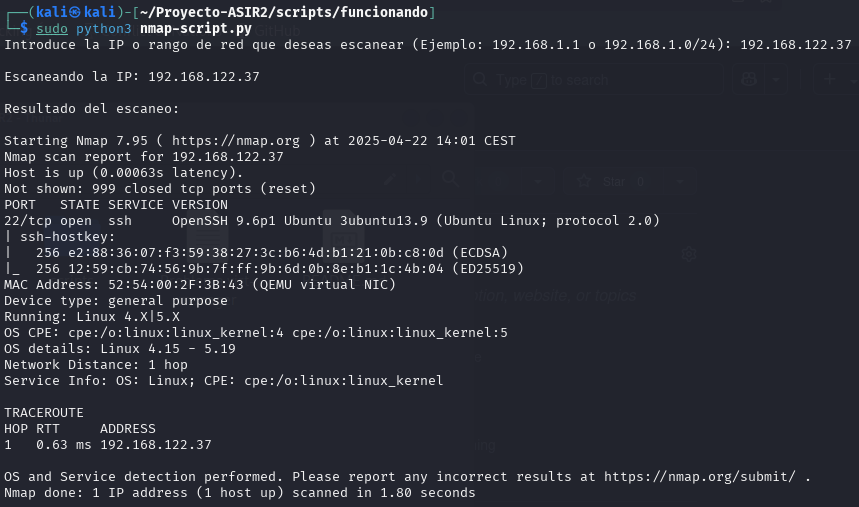
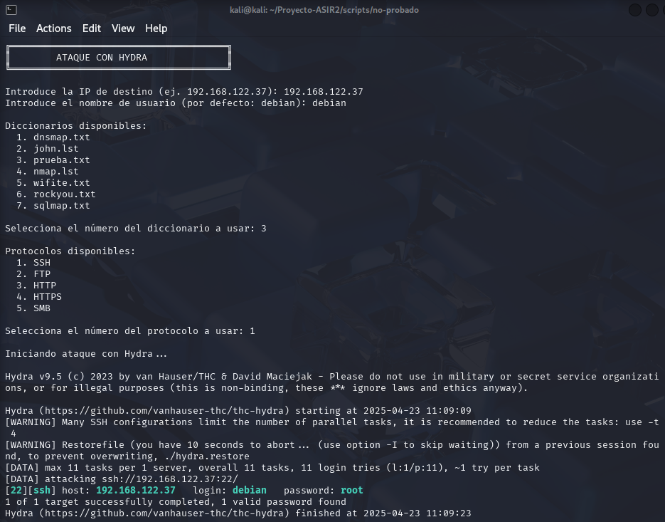
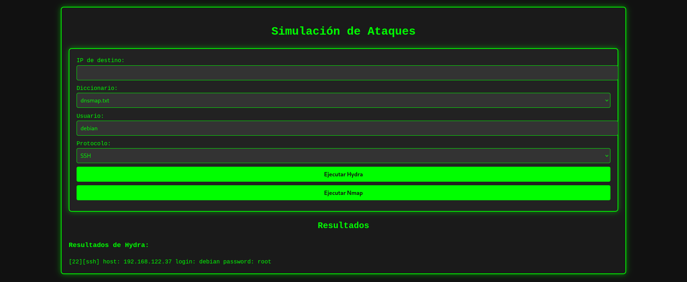
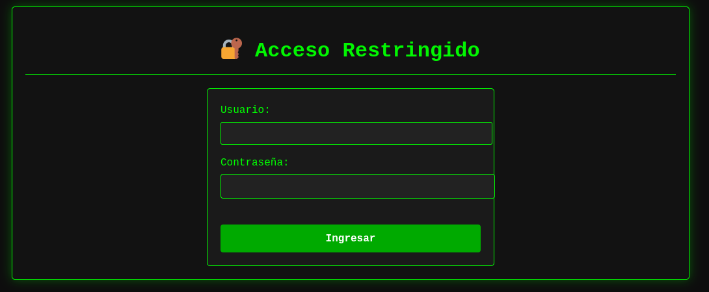

## 🌳 Estructura del Proyecto

`~/Proyecto-ASIR2/`

├── 📸 [capturas/](./capturas/) – Evidencias y pantallazos del proyecto  
├── 📂 [diccionarios/](./diccionarios/) – Listas de contraseñas para ataques de fuerza bruta  
├── 🌐 [flask-app/](./flask-app/) – Interfaz web desarrollada con Flask  
│   ├── 🐍 [app.py](./flask-app/app.py) – Código principal de la aplicación Flask  
│   ├── 🧾 [templates/](./flask-app/templates/) – Plantillas HTML para la web  
│   │   ├── 📝 [index.html](./flask-app/templates/index.html) – Página principal de la interfaz  
│   │   └── 📝 [login.html](./flask-app/templates/login.html) – Formulario de inicio de sesión  
│   └── 🎨 [static/](./flask-app/static/) – Archivos estáticos (CSS, JS, etc.)  
│       └── 🧵 [styles.css](./flask-app/static/styles.css) – Hojas de estilo personalizadas para la interfaz web  
├── ⚙️ [scripts/](./scripts/) – Automatización de tareas con Python y Bash  
│   ├── 🐉 [ataque-hydra.py](./scripts/ataque-hydra.py) – Script para ataques de fuerza bruta con Hydra  
│   ├── 🗑️ [borra-maquina.sh](./scripts/borra-maquina.sh) – Script para eliminar máquinas virtuales  
│   ├── 🔄 [convertir-vmdk-qcow2-actualizado.sh](./scripts/convertir-vmdk-qcow2-actualizado.sh) – Conversión de discos VMDK a QCOW2  
│   ├── ⚙️ [crea-maquina.sh](./scripts/crea-maquina.sh) – Script interactivo para crear máquinas virtuales  
│   ├── 🔍 [nmap-script.py](./scripts/nmap-script.py) – Script para escaneos de puertos con Nmap  
│   └── 🧪 [subprocess](./scripts/subprocess) – Subprocesos auxiliares en Python  
└── 📘 [README.md](./README.md) – Documentación principal del proyecto


# Simulación Automática de Ataques y Respuesta con Python

**Autor:** Vicente González Sierra  
**Tutor:** Francisco Ávila  

**Centro Educativo:** I.E.S Francisco Romero Vargas (Jerez de la Frontera)  
**Ciclo Formativo:** Administración de Sistemas Informáticos en Red (ASIR)  
**Curso:** 2024/2025  

---

## 1. Introducción  
Este proyecto tiene como objetivo desarrollar un sistema automatizado que simule ataques informáticos y analice las respuestas de los mecanismos de defensa, como firewalls, Fail2Ban y sistemas SIEM (Wazuh).  

El sistema permitirá realizar pruebas de seguridad controladas para evaluar la efectividad de las medidas implementadas y mejorar la protección de la infraestructura.  

---

## 2. Finalidad  
El proyecto servirá para:  
- Evaluar la respuesta de sistemas de seguridad ante ataques simulados.  
- Automatizar la simulación de ataques como escaneos de puertos, ataques de fuerza bruta y DoS.  
- Ayudar a detectar vulnerabilidades y mejorar la seguridad.  
- Generar reportes detallados y alertas en tiempo real sobre los eventos de seguridad.  

---

## 3. Objetivos  
Los objetivos principales de este proyecto son:  
- Implementar un script en **Python** que realice escaneos de puertos con **Nmap**.  
- Desarrollar ataques simulados de **fuerza bruta** y **DoS** en un entorno controlado.  
- Analizar los registros de seguridad para evaluar la respuesta de **Fail2Ban** y **Wazuh**.  
- Crear un **panel de control web** con **Flask** y **Grafana** para la visualización de eventos.  
- Configurar un sistema de **alertas en Telegram o correo electrónico** ante incidentes detectados.  

---

## 4. Medios Necesarios  

### **Hardware:**  
- Máquina virtual con **Linux** para ejecutar las pruebas.  
- Red local configurada para las simulaciones.  

### **Software:**  
- **Python** para la automatización de ataques.  
- **Nmap** y **Scapy** para el análisis de red.  
- **Fail2Ban** y **Wazuh** para la detección y respuesta a ataques.  
- **Flask** y **Grafana** para la visualización de eventos.  
- **Docker** para ejecutar entornos aislados.  
- **API de Telegram** o servidor de correo para notificaciones.  

---

## 5. Planificación  

| **Tarea** | **Tiempo estimado** |
|------------------------------|----------------|
| Instalación y configuración del entorno | 5 horas |
| Desarrollo del escaneo de puertos con Nmap | 4 horas |
| Implementación de ataques de fuerza bruta | 6 horas |
| Simulación de ataque DoS con Python | 5 horas |
| Integración con Fail2Ban y Wazuh | 6 horas |
| Creación del panel de control con Flask y Grafana | 8 horas |
| Configuración de alertas en Telegram/correo | 4 horas |
| Pruebas de seguridad y ajustes | 7 horas |
| Documentación del proyecto | 6 horas |
| **Total estimado:** | **51 horas** |

---

## Creación de primeros scripts (outdated)

### 1. `CreaAtaque1.sh`

Este script se utiliza para crear la máquina virtual **ataque1** en KVM utilizando la herramienta `virt-install`. Configura la VM con 2 GB de RAM, 2 vCPUs y un disco de 10 GB, e instala una imagen de Ubuntu 22.04.
  ```bash
  virt-install --name ataque1 \
  --ram 2048 --vcpus 2 \
  --disk path=/var/lib/libvirt/images/ataque1.qcow2,size=10 \
  --os-type linux --os-variant ubuntu22.04 \
  --network bridge=virbr0 \
  --cdrom /var/lib/libvirt/boot/ubuntu.iso \
  --graphics none --console pty,target_type=serial
  ```

### **Uso**:

1. Descargar la versión Ubuntu 24.04.
  ```bash
  wget https://releases.ubuntu.com/22.04/ubuntu-22.04.4-live-server-amd64.iso -O ubuntu-22.04.iso
  ```

2. Para poder ejecutar el script, primero debes dar permisos de ejecución con el siguiente comando:
  ```bash
  chmod +x ./lab/CreaAtaque1.sh
  ```
3. Ejecuta el siguiente comando en la terminal:
   ```bash
   ./lab/CreaAtaque1.sh
   ```

---

### 2. `BorraAtaque1.sh`

Este script elimina la máquina virtual **ataque1** y borra su disco asociado. Utiliza `virsh` para detener y eliminar la máquina, asegurando que no queden restos de la VM en el sistema.
  ```bash
  virsh destroy ataque1
  virsh undefine ataque1
  rm -f /var/lib/libvirt/images/ataque1.qcow2
  ```

#### **Uso**

Para poder ejecutar el script, primero debes dar permisos de ejecución con el siguiente comando:
  ```bash
  chmod +x ./lab/BorraAtaque1.sh
  ```

Ejecuta el siguiente comando:
  ```bash
  ./lab/BorraAtaque1.sh
  ```

---

### Búsqueda sobre máquinas vulnerables y automatización

### Metasploitable

Metasploitable 2 es una máquina vulnerable con fallos en SSH, FTP, MySQL y Samba, credenciales débiles, inyección SQL y ejecución remota de código. Es ideal para pruebas de penetración y análisis de seguridad.

### Login

Usuario: "msfadmin" <br>
Contraseña: "msfadmin"

Descargar [Metasploitable](https://sourceforge.net/projects/metasploitable/)

### Conversión a qcow2 y automatización de la instalación de máquinas vulnerables (SIN TERMINAR)

  ```bash
  #!/bin/bash

VM_NAME="Metasploitable2"
VMDK_PATH="/ruta/al/archivo/Metasploitable.vmdk"
QCOW2_PATH="/var/lib/libvirt/images/Metasploitable2.qcow2"
ISO_PATH="/usr/share/virtio-win/virtio-win.iso"

function instalar_vm() {
    echo "Convirtiendo VMDK a QCOW2..."
    qemu-img convert -f vmdk -O qcow2 "$VMDK_PATH" "$QCOW2_PATH"
    
    echo "Creando máquina virtual en KVM..."
    virt-install \
        --name "$VM_NAME" \
        --ram 1024 --vcpus 1 \
        --disk path="$QCOW2_PATH",format=qcow2 \
        --os-type linux --os-variant generic \
        --network network=default,model=virtio \
        --graphics none \
        --console pty,target_type=serial \
        --import
    
    echo "Instalación completada. Usa 'virsh list --all' para verificar."
}

function eliminar_vm() {
    echo "Eliminando la máquina virtual..."
    virsh destroy "$VM_NAME"
    virsh undefine "$VM_NAME"
    rm -f "$QCOW2_PATH"
    echo "Máquina eliminada correctamente."
}

case "$1" in
    instalar)
        instalar_vm
        ;;
    eliminar)
        eliminar_vm
        ;;
    *)
        echo "Uso: $0 {instalar|eliminar}"
        exit 1
        ;;
esac
  ```

### Permisos 

  ```bash
  chmod +x ./Defensa1.sh
  ```

### Actualización de script para conversión a qcow2 y automatización de creación y borrado de máquinas vulnerables.

He actualizado el script para que solicite por pantalla al usuario los datos para la creación y borrado de la VM con las diferentes opciones.

  ```bash
#!/bin/bash

function mostrar_menu() {
  echo "Selecciona una opción:"
  echo "1) Instalar máquina virtual"
  echo "2) Eliminar máquina virtual"
  echo "3) Salir"
}

function solicitar_valores() {
  echo "Configuración de la máquina virtual:"
  
  # Opciones predefinidas para el nombre de la VM
  declare -A nombres_vm=(
    [1]="Metasploitable2"
    [2]="KaliLinux"
    [3]="UbuntuServer"
  )
  echo "Elige un nombre para la máquina virtual:"
  for key in "${!nombres_vm[@]}"; do
    echo "$key) ${nombres_vm[$key]}"
  done
  read -p "Opción (1-${#nombres_vm[@]}): " opcion_nombre
  VM_NAME=${nombres_vm[$opcion_nombre]}

  # Opciones predefinidas para la ruta del VMDK
  declare -A rutas_vmdk=(
    [1]="/ruta/al/archivo/Metasploitable.vmdk"
    [2]="/ruta/al/archivo/KaliLinux.vmdk"
    [3]="/ruta/al/archivo/UbuntuServer.vmdk"
  )
  echo "Elige la ruta del archivo VMDK:"
  for key in "${!rutas_vmdk[@]}"; do
    echo "$key) ${rutas_vmdk[$key]}"
  done
  read -p "Opción (1-${#rutas_vmdk[@]}): " opcion_vmdk
  VMDK_PATH=${rutas_vmdk[$opcion_vmdk]}

  # Ruta predefinida para el archivo QCOW2
  QCOW2_PATH="/var/lib/libvirt/images/${VM_NAME}.qcow2"

  # Opciones predefinidas para la RAM
  declare -A opciones_ram=(
    [1]=1024
    [2]=2048
    [3]=4096
  )
  echo "Elige la cantidad de RAM (en MB):"
  for key in "${!opciones_ram[@]}"; do
    echo "$key) ${opciones_ram[$key]} MB"
  done
  read -p "Opción (1-${#opciones_ram[@]}): " opcion_ram
  RAM=${opciones_ram[$opcion_ram]}

  # Opciones predefinidas para el número de vCPUs
  declare -A opciones_vcpus=(
    [1]=1
    [2]=2
    [3]=4
  )
  echo "Elige el número de vCPUs:"
  for key in "${!opciones_vcpus[@]}"; do
    echo "$key) ${opciones_vcpus[$key]} vCPU(s)"
  done
  read -p "Opción (1-${#opciones_vcpus[@]}): " opcion_vcpus
  VCPUS=${opciones_vcpus[$opcion_vcpus]}
}

function instalar_vm() {
  echo "Convirtiendo VMDK a QCOW2..."
  qemu-img convert -f vmdk -O qcow2 "$VMDK_PATH" "$QCOW2_PATH"
  
  echo "Creando máquina virtual en KVM..."
  virt-install \
      --name "$VM_NAME" \
      --ram "$RAM" --vcpus "$VCPUS" \
      --disk path="$QCOW2_PATH",format=qcow2 \
      --os-type linux --os-variant generic \
      --network network=default,model=virtio \
      --graphics none \
      --console pty,target_type=serial \
      --import
  
  echo "Instalación completada. Usa 'virsh list --all' para verificar."
}

function eliminar_vm() {
  echo "Eliminando la máquina virtual..."
  virsh destroy "$VM_NAME"
  virsh undefine "$VM_NAME"
  rm -f "$QCOW2_PATH"
  echo "Máquina eliminada correctamente."
}

while true; do
  mostrar_menu
  read -p "Opción (1-3): " opcion_principal

  case "$opcion_principal" in
    1)
      solicitar_valores
      instalar_vm
      ;;
    2)
      solicitar_valores
      eliminar_vm
      ;;
    3)
      echo "Saliendo..."
      exit 0
      ;;
    *)
      echo "Opción no válida. Inténtalo de nuevo."
      ;;
  esac
done
  ```

---

### Script para escanear red en busca de puertos abiertos con Nmap

Este script servirá para escanear una red en busca de puertos abiertos para explotar una vulnerabilidad en una máquina.

  ```bash
#!/bin/bash

if [ -z "$1" ]; then
  echo "Uso: $0 <dirección_ip_o_host>"
  exit 1
fi

TARGET=$1

echo "Escaneando puertos abiertos de: $TARGET"

nmap -p- --open $TARGET
  ```

### Dar permisos al script

  ```bash
chmod +x scan_ports.sh
  ```

### Ejecutar el script

  ```bash
./scan_ports.sh 192.168.1.1
  ```

---

# ACTUALIZACIÓN DE TODOS LOS SCRIPTS

---

## 🛠️ CREACIÓN DE MÁQUINAS VIRTUALES

### `crea-maquina.sh`

```bash
#!/bin/bash

# Colores
GREEN='\033[0;32m'
RED='\033[0;31m'
YELLOW='\033[1;33m'
BLUE='\033[1;34m'
NC='\033[0m'

# Rutas
BASE_PROYECTO="$HOME/Proyecto-ASIR2/machines"
ISO_DIR="$BASE_PROYECTO/iso"

# --- Función para mostrar cabeceras ---
show_header() {
    clear
    echo -e "${YELLOW}"
    echo "╔══════════════════════════════════════════╗"
    echo "║   $1"
    echo "╚══════════════════════════════════════════╝"
    echo -e "${NC}\n"
}

# --- Buscar imagen ---
buscar_imagen() {
    show_header "SELECCIONAR TIPO DE INSTALACIÓN"
    echo -e "${BLUE}► ¿Desde qué tipo de archivo quieres crear la máquina?${NC}"
    echo -e "  [1] Archivo ISO\n  [2] Archivo QCOW2"
    echo -en "${BLUE}➤ Opción: ${NC}"
    read tipo_opcion

    if [[ "$tipo_opcion" == "1" ]]; then
        tipo="iso"
    elif [[ "$tipo_opcion" == "2" ]]; then
        tipo="qcow2"
    else
        echo -e "${RED}✖ Opción inválida.${NC}"
        exit 1
    fi

    echo -e "\n${BLUE}Buscando archivos .$tipo en: ${ISO_DIR}${NC}\n"
    mapfile -t ARCHIVOS < <(find "$ISO_DIR" -type f -name "*.$tipo" 2>/dev/null | sort)

    if [ ${#ARCHIVOS[@]} -eq 0 ]; then
        echo -e "${RED}✖ No se encontraron archivos .$tipo.${NC}"
        exit 1
    fi

    echo -e "${GREEN}✔ Archivos disponibles:${NC}\n"
    for i in "${!ARCHIVOS[@]}"; do
        echo "  [$((i+1))] $(basename "${ARCHIVOS[$i]}")"
    done

    while true; do
        echo -en "\n${BLUE}➤ Selecciona un archivo (1-${#ARCHIVOS[@]}): ${NC}"
        read num
        if [[ "$num" =~ ^[0-9]+$ ]] && [ "$num" -ge 1 ] && [ "$num" -le ${#ARCHIVOS[@]} ]; then
            IMG_PATH="${ARCHIVOS[$((num-1))]}"
            break
        else
            echo -e "${RED}✖ Opción inválida.${NC}"
        fi
    done
}

# --- Elegir ubicación ---
elegir_ubicacion() {
    show_header "SELECCIONAR UBICACIÓN"
    echo -e "${BLUE}► ¿Dónde quieres guardar la máquina virtual?${NC}"
    echo -e "  [1] ataque\n  [2] defensa"
    echo -en "${BLUE}➤ Opción: ${NC}"
    read opcion

    case "$opcion" in
        1) VM_DIR="$BASE_PROYECTO/ataque/$VM_NAME" ;;
        2) VM_DIR="$BASE_PROYECTO/defensa/$VM_NAME" ;;
        *) echo -e "${RED}✖ Opción inválida.${NC}"; exit 1 ;;
    esac
}

# --- Selección de hardware ---
seleccionar_recursos() {
    show_header "CONFIGURAR RECURSOS"

    echo -e "${BLUE}► Elige la cantidad de RAM (MB):${NC}"
    echo -e "  [1] 1024 MB\n  [2] 2048 MB\n  [3] 4096 MB"
    echo -en "${BLUE}➤ Opción: ${NC}"
    read ram_opcion
    case "$ram_opcion" in
        1) RAM=1024 ;;
        2) RAM=2048 ;;
        3) RAM=4096 ;;
        *) echo -e "${RED}✖ Opción inválida.${NC}"; exit 1 ;;
    esac

    echo -e "\n${BLUE}► Elige la cantidad de CPUs:${NC}"
    echo -e "  [1] 1 CPU\n  [2] 2 CPUs\n  [3] 4 CPUs\n  [4] 8 CPUs"
    echo -en "${BLUE}➤ Opción: ${NC}"
    read cpu_opcion
    case "$cpu_opcion" in
        1) VCPU=1 ;;
        2) VCPU=2 ;;
        3) VCPU=4 ;;
        4) VCPU=8 ;;
        *) echo -e "${RED}✖ Opción inválida.${NC}"; exit 1 ;;
    esac

    echo -en "\n${BLUE}► Tamaño del disco en GB (ej. 20): ${NC}"
    read DISK_SIZE
    [[ ! "$DISK_SIZE" =~ ^[0-9]+$ ]] && echo -e "${RED}✖ Tamaño no válido.${NC}" && exit 1

    echo -e "\n${BLUE}► Tipo de red:${NC}"
    echo -e "  [1] NAT (default)\n  [2] Bridge (br0)"
    echo -en "${BLUE}➤ Opción: ${NC}"
    read net_opcion
    case "$net_opcion" in
        1) NET_OPT="--network network=default" ;;
        2) NET_OPT="--network bridge=br0" ;;
        *) echo -e "${RED}✖ Opción inválida.${NC}"; exit 1 ;;
    esac
}

# --- Crear la máquina virtual ---
crear_vm() {
    show_header "CREAR MÁQUINA VIRTUAL"

    mkdir -p "$VM_DIR" || {
        echo -e "${RED}✖ Error al crear el directorio $VM_DIR.${NC}"
        exit 1
    }

    DISK_PATH="$VM_DIR/$VM_NAME.qcow2"
    qemu-img create -f qcow2 "$DISK_PATH" "${DISK_SIZE}G"

    echo -e "${YELLOW}⚙️ Creando la máquina virtual...${NC}\n"

    if [[ "$tipo" == "iso" ]]; then
        virt-install \
            --name "$VM_NAME" \
            --ram "$RAM" \
            --vcpus "$VCPU" \
            --disk path="$DISK_PATH",format=qcow2 \
            --os-variant generic \
            $NET_OPT \
            --graphics spice \
            --cdrom "$IMG_PATH" \
            --noautoconsole
    else
        virt-install \
            --name "$VM_NAME" \
            --ram "$RAM" \
            --vcpus "$VCPU" \
            --disk path="$IMG_PATH",format=qcow2 \
            --os-variant generic \
            $NET_OPT \
            --graphics spice \
            --import \
            --noautoconsole
    fi

    echo -e "\n${GREEN}✅ Máquina '$VM_NAME' creada exitosamente.${NC}"
    echo -e "Ubicación: $VM_DIR"
    echo -e "Para iniciar: ${BLUE}virsh start $VM_NAME${NC}"
    echo -e "Para conectarte: ${BLUE}virt-viewer $VM_NAME${NC}\n"
}

# --- Main ---
show_header "CREADOR DE MÁQUINAS VIRTUALES"
echo -en "${BLUE}► Nombre de la máquina virtual: ${NC}"
read VM_NAME
[[ -z "$VM_NAME" ]] && echo -e "${RED}✖ El nombre no puede estar vacío.${NC}" && exit 1

buscar_imagen
elegir_ubicacion
seleccionar_recursos
crear_vm
```
---

He actualizado el script para que:

### 1. Definición de variables y colores
Se definen variables para aplicar colores en los mensajes del terminal (`GREEN`, `RED`, `YELLOW`, `BLUE`, `NC`) y rutas base del proyecto:

- `BASE_PROYECTO="$HOME/Proyecto-ASIR2/machines"`
- `ISO_DIR="$BASE_PROYECTO/iso"`

---

### 2. Cabecera estética
Se ha creado la función `show_header` que limpia la pantalla y muestra una cabecera con bordes y colores llamativos para cada sección del script.

---

### 3. Selección del tipo de instalación
Función: `buscar_imagen`

- Permite elegir si se quiere crear la máquina desde:
  - [1] Archivo `.iso`
  - [2] Archivo `.qcow2`

- Busca en el directorio `~/Proyecto-ASIR2/machines/iso` y muestra los archivos disponibles.
- Guarda la ruta del archivo seleccionado en la variable `IMG_PATH`.

---

### 4. Selección del directorio de destino
Función: `elegir_ubicacion`

- Muestra opciones para elegir dónde se va a guardar la máquina virtual:
  - [1] `ataque`
  - [2] `defensa`

- Se guarda la ruta de destino completa en la variable `VM_DIR`, usando el nombre que introdujo el usuario.

---

### 5. Configuración de hardware
Función: `seleccionar_recursos`

Permite al usuario seleccionar:

- RAM: 1024 MB, 2048 MB, 4096 MB
- vCPU: 1, 2, 4, 8
- Espacio en disco en GB (ingresado manualmente)
- Tipo de red: NAT (default) o Bridge (br0)

---

### 6. Creación de la máquina virtual
Función: `crear_vm`

- Crea el directorio de la máquina virtual dentro de la carpeta correspondiente.
- Si se seleccionó `.iso`:
  - Crea un disco vacío `.qcow2`.
  - Usa `virt-install` con `--cdrom` para instalar desde ISO.
- Si se seleccionó `.qcow2`:
  - Usa `virt-install` con `--import` para cargar la imagen ya instalada.

Muestra un mensaje final con:

- Estado de creación
- Ruta donde quedó almacenada
- Comandos útiles para iniciar y visualizar la máquina:
  - `virsh start <nombre>`
  - `virt-viewer <nombre>`

---

### 7. Flujo principal del script
1. Muestra la cabecera principal del script.
2. Pide el nombre de la nueva máquina virtual.
3. Ejecuta, en orden:
   - `buscar_imagen`
   - `elegir_ubicacion`
   - `seleccionar_recursos`
   - `crear_vm`

---

## 🗑️ ELIMINACIÓN DE MÁQUINAS VIRTUALES

### `borra-maquina.sh`

```bash
#!/bin/bash

# Colores
RED='\033[0;31m'
GREEN='\033[0;32m'
YELLOW='\033[1;33m'
NC='\033[0m'

ATAQUE_DIR="$HOME/Proyecto-ASIR2/machines/ataque"
DEFENSA_DIR="$HOME/Proyecto-ASIR2/machines/defensa"

# Cabecera
show_header() {
    clear
    echo -e "${YELLOW}"
    echo "╔════════════════════════════════════════╗"
    echo "║     ELIMINADOR DE MÁQUINAS VIRT-MGR    ║"
    echo "╚════════════════════════════════════════╝"
    echo -e "${NC}"
}

# Seleccionar tipo de máquina
select_machine_type() {
    show_header
    echo "¿Qué tipo de máquina quieres eliminar?"
    echo "1) Ataque"
    echo "2) Defensa"
    read -p "Opción [1/2]: " tipo

    case "$tipo" in
        2) DIR="$DEFENSA_DIR" ;;
        1) DIR="$ATAQUE_DIR" ;;
        *) echo -e "${RED}Opción no válida. Saliendo...${NC}"; exit 1 ;;
    esac

    if [ ! -d "$DIR" ]; then
        echo -e "${RED}Directorio no encontrado: $DIR${NC}"
        exit 1
    fi
}

# Seleccionar máquina
select_machine() {
    show_header
    echo -e "Máquinas disponibles en: ${GREEN}$DIR${NC}"
    echo "----------------------------------------"

    machines=()
    while IFS= read -r dir; do
        machines+=("$(basename "$dir")")
    done < <(find "$DIR" -mindepth 1 -maxdepth 1 -type d | sort)

    if [ ${#machines[@]} -eq 0 ]; then
        echo -e "${RED}No hay máquinas disponibles para eliminar.${NC}"
        exit 1
    fi

    for i in "${!machines[@]}"; do
        echo "$((i+1))) ${machines[$i]}"
    done

    read -p "Selecciona una máquina [1-${#machines[@]}]: " choice
    if ! [[ "$choice" =~ ^[0-9]+$ ]] || [ "$choice" -lt 1 ] || [ "$choice" -gt "${#machines[@]}" ]; then
        echo -e "${RED}Selección no válida. Saliendo...${NC}"
        exit 1
    fi

    MACHINE_FOLDER="${machines[$((choice-1))]}"
    MACHINE_PATH="$DIR/$MACHINE_FOLDER"
}

# Buscar nombre de la máquina
find_machine_file() {
    QCOW2_FILE=$(find "$MACHINE_PATH" -type f -name "*.qcow2")

    if [[ -z "$QCOW2_FILE" ]]; then
        echo -e "${RED}No se encontró un archivo .qcow2 en $MACHINE_PATH.${NC}"
        exit 1
    fi

    MACHINE_NAME=$(basename "$QCOW2_FILE" .qcow2)
}

# Confirmación
confirm_deletion() {
    show_header
    echo -e "${YELLOW}Resumen de eliminación:${NC}"
    echo "----------------------------------------"
    echo -e "Nombre máquina: ${GREEN}$MACHINE_NAME${NC}"
    echo -e "Ruta completa:  ${GREEN}$MACHINE_PATH${NC}"
    echo "----------------------------------------"

    read -p "¿Estás seguro de que quieres eliminarla? [s/N]: " confirm
    if [[ ! "$confirm" =~ ^[sS]$ ]]; then
        echo -e "${YELLOW}Operación cancelada.${NC}"
        exit 0
    fi
}

# Eliminar con virsh y del disco
delete_machine() {
    echo -e "${YELLOW}Eliminando desde virt-manager...${NC}"
    virsh destroy "$MACHINE_NAME" 2>/dev/null
    virsh undefine "$MACHINE_NAME" --remove-all-storage --nvram 2>/dev/null

    if virsh list --all | grep -q "$MACHINE_NAME"; then
        echo -e "${RED}La máquina aún aparece en virt-manager. Revisa manualmente.${NC}"
        exit 1
    fi

    echo -e "${YELLOW}Eliminando carpeta...${NC}"
    rm -rf "$MACHINE_PATH"
    echo -e "${GREEN}✔ Máquina $MACHINE_NAME eliminada correctamente.${NC}"
}

# Ejecución
select_machine_type
select_machine
find_machine_file
confirm_deletion
delete_machine

exit 0
```

Este script permite **eliminar completamente una máquina virtual**, tanto desde el sistema de archivos como desde `virt-manager` utilizando `virsh`.

---

### 1. Selección del tipo de máquina
- Pregunta si se quiere eliminar una máquina de:
  - `Ataque` (`~/Proyecto-ASIR2/machines/ataque`)
  - `Defensa` (`~/Proyecto-ASIR2/machines/defensa`)
- Asigna la ruta correspondiente en base a la elección.

---

### 2. Listado de máquinas disponibles
- Muestra todas las carpetas dentro del directorio seleccionado.
- Cada carpeta se asume como una máquina virtual independiente.
- Si no hay máquinas, finaliza el script con un aviso.

---

### 3. Selección de la máquina a eliminar
- El usuario elige el número de la máquina listada.
- El script valida que la entrada sea un número válido.
- Busca el archivo `.qcow2` dentro de la carpeta correspondiente.
  - Si no encuentra un archivo `.qcow2`, cancela la operación.

---

### 4. Confirmación y nombre de la máquina
- Extrae el nombre de la máquina desde el archivo `.qcow2`.
- Solicita confirmación al usuario para proceder con la eliminación.

---

### 5. Eliminación desde `virt-manager`
- Usa `virsh destroy` para detener la máquina si está en ejecución.
- Luego la elimina con `virsh undefine` incluyendo `--remove-all-storage` y `--nvram`.
- Verifica que la máquina haya desaparecido de la lista de `virsh`.

---

### 6. Eliminación del directorio
- Si la máquina fue eliminada correctamente de `virt-manager`, borra la carpeta correspondiente de forma recursiva (`rm -rf`).

---

### Resultado final
- La máquina queda completamente eliminada del sistema y de `virt-manager`.

---

## 🔄 CONVERSIÓN DE IMÁGENES A QCOW2

### `convertir-vmdk-qcow2-actualizado.sh`

```bash
#!/bin/bash

# Script para convertir imágenes de máquinas virtuales a formato QCOW2
# Versión: 1.2 (Añadida opción para mover el archivo convertido a la carpeta ISO)

# Colores para mensajes
RED='\033[0;31m'
GREEN='\033[0;32m'
YELLOW='\033[1;33m'
NC='\033[0m' # No Color

# Función para mostrar cabeceras
show_header() {
    clear
    echo -e "${YELLOW}"
    echo "╔══════════════════════════════════════════╗"
    echo "║   CONVERSOR A QCOW2 PARA VIRT-MANAGER   ║"
    echo "╚══════════════════════════════════════════╝"
    echo -e "${NC}"
}

# Función para verificar dependencias
check_dependencies() {
    if ! command -v qemu-img &> /dev/null; then
        echo -e "${RED}Error: qemu-img no está instalado.${NC}"
        echo "Instale con: sudo apt install qemu-utils"
        exit 1
    fi
}

# Función para seleccionar ruta base
select_base_path() {
    show_header
    echo "Seleccione la ubicación base:"
    echo "1) ~/Proyecto-ASIR2/machines/ataque"
    echo "2) ~/Proyecto-ASIR2/machines/defensa"
    read -p "Opción [1/2]: " base_option

    case $base_option in
        2) BASE_PATH="$HOME/Proyecto-ASIR2/machines/defensa" ;;
        *) BASE_PATH="$HOME/Proyecto-ASIR2/machines/ataque" ;;
    esac

    if [ ! -d "$BASE_PATH" ]; then
        echo -e "${RED}Error: No se encontró el directorio $BASE_PATH${NC}"
        exit 1
    fi
}

# Función para seleccionar subdirectorio
select_subdirectory() {
    show_header
    echo -e "Directorios disponibles en ${GREEN}$BASE_PATH${NC}:"
    echo "----------------------------------------"

    dir_options=()
    while IFS= read -r dir; do
        dir_options+=("$dir")
    done < <(find "$BASE_PATH" -maxdepth 1 -type d | sort | tail -n +2)

    for i in "${!dir_options[@]}"; do
        echo "$((i+1))) ${dir_options[$i]##*/}"
    done

    read -p "Seleccione el directorio [1-${#dir_options[@]}]: " dir_choice

    SELECTED_DIR="${dir_options[$((dir_choice-1))]}"
    if [ ! -d "$SELECTED_DIR" ]; then
        echo -e "${RED}Error: Directorio no válido${NC}"
        exit 1
    fi
}

# Función para seleccionar archivo
select_file_to_convert() {
    show_header
    echo -e "Archivos disponibles en ${GREEN}$SELECTED_DIR${NC}:"
    echo "----------------------------------------"

    file_options=()
    while IFS= read -r file; do
        file_options+=("$file")
    done < <(find "$SELECTED_DIR" -type f \( -iname "*.vmdk" -o -iname "*.vdi" -o -iname "*.raw" \))

    if [ ${#file_options[@]} -eq 0 ]; then
        echo -e "${RED}No se encontraron archivos compatibles (.vmdk, .vdi, .raw)${NC}"
        exit 1
    fi

    for i in "${!file_options[@]}"; do
        echo "$((i+1))) ${file_options[$i]##*/}"
    done

    read -p "Seleccione el archivo a convertir [1-${#file_options[@]}]: " file_choice

    INPUT_FILE="${file_options[$((file_choice-1))]}"
    OUTPUT_FILE="${INPUT_FILE%.*}.qcow2"
}

# Función para confirmar
confirm_conversion() {
    show_header
    echo -e "${YELLOW}Resumen de la conversión:${NC}"
    echo "----------------------------------------"
    echo -e "Archivo origen:  ${GREEN}$INPUT_FILE${NC}"
    echo -e "Archivo destino: ${GREEN}$OUTPUT_FILE${NC}"
    echo "----------------------------------------"

    read -p "¿Desea continuar con la conversión? [s/N]: " confirm
    if [[ ! "$confirm" =~ ^[sS]$ ]]; then
        echo -e "${RED}Conversión cancelada${NC}"
        exit 0
    fi
}

# Función para convertir
convert_to_qcow2() {
    echo -e "${YELLOW}Iniciando conversión...${NC}"
    
    if [ -f "$OUTPUT_FILE" ]; then
        read -p "El archivo $OUTPUT_FILE ya existe. ¿Sobreescribir? [s/N]: " overwrite
        if [[ ! "$overwrite" =~ ^[sS]$ ]]; then
            echo -e "${RED}Conversión cancelada${NC}"
            exit 0
        fi
        rm -f "$OUTPUT_FILE"
    fi

    if qemu-img convert -O qcow2 "$INPUT_FILE" "$OUTPUT_FILE"; then
        echo -e "${GREEN}✔ Conversión completada con éxito${NC}"
        echo -e "Archivo creado: ${GREEN}$OUTPUT_FILE${NC}"
        chmod 644 "$OUTPUT_FILE"
        echo -e "Permisos ajustados a 644"
    else
        echo -e "${RED}✖ Error durante la conversión${NC}"
        exit 1
    fi
}

# Función para mover a carpeta ISO
ask_destination_path() {
    echo
    read -p "¿Desea mover el archivo convertido a ~/Proyecto-ASIR2/machines/iso? [s/N]: " move_choice
    if [[ "$move_choice" =~ ^[sS]$ ]]; then
        ISO_DIR="$HOME/Proyecto-ASIR2/machines/iso"
        mkdir -p "$ISO_DIR"
        mv "$OUTPUT_FILE" "$ISO_DIR/"
        echo -e "${GREEN}✔ Archivo movido a: $ISO_DIR/${OUTPUT_FILE##*/}${NC}"
    else
        echo -e "${YELLOW}✔ Archivo conservado en su ubicación actual${NC}"
    fi
}

# --- Ejecución principal ---
check_dependencies
select_base_path
select_subdirectory
select_file_to_convert
confirm_conversion
convert_to_qcow2
ask_destination_path

exit 0
```

Este script permite convertir archivos de imágenes de máquinas virtuales (`.vmdk`, `.vdi`, `.raw`) al formato QCOW2 utilizado por `virt-manager`. También ofrece la opción de mover la imagen convertida a la carpeta de ISOs del proyecto.

---

### 1. Cabecera y dependencias
- Muestra una cabecera con diseño en ASCII.
- Verifica que la utilidad `qemu-img` esté instalada.
  - Si no lo está, recomienda instalarla: `sudo apt install qemu-utils`.

---

### 2. Selección de ubicación base
Función: `select_base_path`

- Permite elegir si buscar imágenes en:
  - `~/Proyecto-ASIR2/machines/ataque`
  - `~/Proyecto-ASIR2/machines/defensa`

---

### 3. Selección de subdirectorio
Función: `select_subdirectory`

- Lista todas las carpetas dentro de la ruta seleccionada (por ejemplo, `ataque/nmap`, `defensa/wazuh`).
- El usuario selecciona de forma interactiva en qué directorio buscar los archivos a convertir.

---

### 4. Selección del archivo a convertir
Función: `select_file_to_convert`

- Busca archivos con extensiones:
  - `.vmdk`
  - `.vdi`
  - `.raw`
- Permite al usuario elegir el archivo a convertir.
- El archivo de salida tendrá el mismo nombre pero con extensión `.qcow2`.

---

### 5. Confirmación previa a la conversión
Función: `confirm_conversion`

- Muestra un resumen con:
  - Ruta del archivo original
  - Ruta del archivo convertido
- Pregunta si se desea continuar.

---

### 6. Conversión a formato QCOW2
Función: `convert_to_qcow2`

- Usa `qemu-img convert` para convertir la imagen.
- Si el archivo de salida ya existe, pregunta si se desea sobrescribirlo.
- Ajusta los permisos del archivo convertido a `644`.

---

### 7. Mover archivo a carpeta de ISOs
Función: `ask_destination_path`

- Tras la conversión, ofrece mover el archivo `.qcow2` a:
  - `~/Proyecto-ASIR2/machines/iso`
- Crea la carpeta si no existe.

---

### 8. Ejecución principal

El script sigue esta secuencia:

1. `check_dependencies`
2. `select_base_path`
3. `select_subdirectory`
4. `select_file_to_convert`
5. `confirm_conversion`
6. `convert_to_qcow2`
7. `ask_destination_path`

---

## MÁQUINAS A USAR EN EL LABORATORIO 

### Ataque

- Kali Linux

---

### Defensa 

- Metasploitable
- TinyCoreLinux
- DebianMinimal (netinst)
- Debian 24.04 (usuario: "debian" | contraseña: "root")

---

## 🔍 ESCANEO DE PUERTOS

He creado un script con python para escanear puertos y buscar los puertos abiertos de las máquinas.

### `nmap-script.py`

```bash
import subprocess

def obtener_ip():
    # Pide la IP al usuario
    ip = input("Introduce la IP o rango de red que deseas escanear (Ejemplo: 192.168.1.1 o 192.168.1.0/24): ")
    return ip

def ejecutar_nmap(ip):
    # Ejecuta Nmap con el comando de escaneo completo de la red
    print(f"\nEscaneando la IP: {ip}")
    
    # Comando Nmap
    comando = ["nmap", "-A", ip]
    
    try:
        # Ejecuta el comando Nmap y captura la salida
        resultado = subprocess.run(comando, stdout=subprocess.PIPE, stderr=subprocess.PIPE, text=True)
        
        # Muestra el resultado del escaneo
        print("\nResultado del escaneo:\n")
        print(resultado.stdout)
        
    except Exception as e:
        print(f"Error al ejecutar Nmap: {e}")

def main():
    # Paso 1: Obtener la IP de la red que quiere escanear el usuario
    ip = obtener_ip()
    
    # Paso 2: Ejecutar el escaneo con Nmap
    ejecutar_nmap(ip)

if __name__ == "__main__":
    main()
```

Para ejecutarlo:

```bash
sudo python3 nmap-script.py
```

---

### PRIMER ATAQUE CON NMAP

He escaneado la IP de la máquina "Debian24" y no he encontrado puertos abiertos, así que he instalado openssh para abrir el puerto 22, y volver a escanear, el segundo escaneo fue todo un éxito, encontrando el puerto 22 abierto con el script.



```bash
sudo python3 nmap-script.py
```

---

### SCRIPT PYTHON FUERZA BRUTA CON HYDRA

He creado un script con python, usando Hydra, para intentar entrar con fuerza bruta a una máquina ubuntu, usando listas de claves.
El ataque ha sido exitoso, por el puerto SSH 22, descubriendo que la clave de la IP "192.168.122.37" con usuario "debian" tiene como contraseña "root".



```bash
sudo python3 ataque-hydra.py
```

---

### INSTALAR UN ENTORNO VIRTUAL FLASK

Instalar el paquete necesario

```bash
sudo apt install python3-venv
```

Crear el entorno virtual

```bash
python3 -m venv ~/Proyecto-ASIR2/flask-env
```

Activar el entorno

```bash
source ~/Proyecto-ASIR2/flask-env/bin/activate
```

Una vez dentro del entorno, instalar flask.

```bash
pip install flask
```
Para iniciar la página

```bash
python app.py
```

---

`app.py`

[Ver app.py](flask-app/app.py)

---

### ENTORNO GRÁFICO CON FLASK 

He creado un entorno gráfico, donde poder usar los scripts con GUI.



---

### CREACIÓN DE LOGIN/LOGOUT 

Para más seguridad en la herramienta, he creado un login/logout para que sólo pueda usar la herramienta todo el que tenga el usuario y contraseña.



---

### IMPLEMENTACIÓN DE GRAFANA Y CREACIÓN DE BASE DE DATOS

He instalado grafana y he implementado una base de datos con SQLite para guardar los datos para hacer gráficas con Grafana.


